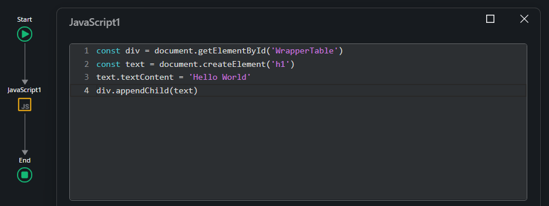
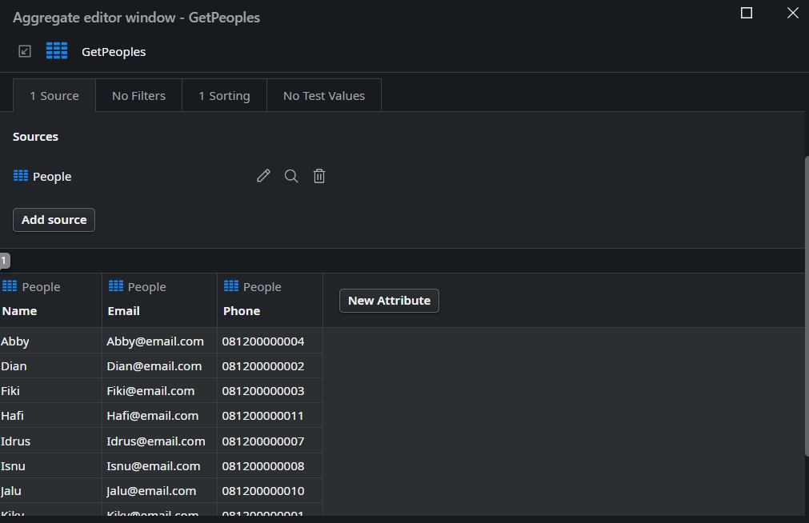
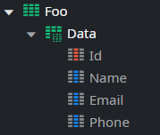
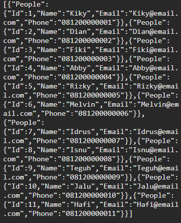
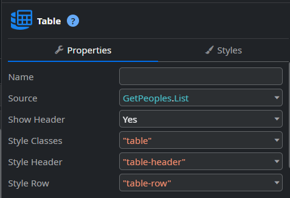

# DOM Manipulation in OutSystems

---

An overview of how to manipulate the Document Object Model (DOM) to display JSON data in a table within OutSystems. It covers the process of parsing JSON data, creating and populating data to HTML elements.

Okay, let's start. So, let's assume there is a `<div>` widget with the ID `WrapperTable`, like shown here.

Wrote this in the On Render:

```javascript
const div = document.getElementById("WrapperTable");
const text = document.createElement("h1");
text.textContent = "Hello World";
div.appendChild(text);
```

{: style="display:block; margin:auto;"}

#### Explanation:

- Targeting the div: First, the div element with the ID `WrapperTable` is selected to serve as the container for the new content.
- Creating the element: Then, a new h1 element is created using document.createElement('h1'). This is how new HTML tags are generated using JavaScript.
- Adding text: The h1 element is assigned the text “Hello World” using text.`textContent = 'Hello World'`.
- Appending to the div: Finally, the newly created h1 element is added to the `WrapperTable` div with `div.appendChild(text)`.

So, your HTML structure looks like this:

```html
<div data-container="" id="WrapperTable">
  <h1>Hello World</h1>
</div>
```

Yeaahh exactly! That's how the DOM works—manipulating elements, Now, let's
move on to the next topic, which is how to populate JSON data into the DOM
itself. I’ll add an aggregate first, so it seems like I have data that I will
later convert to JSON.

{: style="display:block; margin:auto;"}

When you have a list
record in OutSystems, the data structure will look like this:

```json
[
  {
    "People": {
      "Id": 1,
      "Name": "Kiky",
      "Email": "Kiky@email.com",
      "Phone": "081200000001"
    }
  },
  {
    "People": {
      "Id": 2,
      "Name": "Dian",
      "Email": "Dian@email.com",
      "Phone": "081200000002"
    }
  },
  {
    "People": {
      "Id": 3,
      "Name": "Fiki",
      "Email": "Fiki@email.com",
      "Phone": "081200000003"
    }
  },
  {
    "People": {
      "Id": 4,
      "Name": "Abby",
      "Email": "Abby@email.com",
      "Phone": "081200000004"
    }
  }
]
```

This structure repeats the People object for each record, which can be a bit redundant if you just want to access the individual attributes directly. You might want to simplify this format in your JavaScript to access the data more easily.

"Since I want the data to look simple, I created the structure like this, see this image. Then it turned out like this:

{: style="display:block; margin:auto;"}

```json
{
  "Data": [
    {
      "Id": 1,
      "Name": "Kiky",
      "Email": "Kiky@email.com",
      "Phone": "081200000001"
    },
    {
      "Id": 2,
      "Name": "Dian",
      "Email": "Dian@email.com",
      "Phone": "081200000002"
    },
    {
      "Id": 3,
      "Name": "Fiki",
      "Email": "Fiki@email.com",
      "Phone": "081200000003"
    },
    {
      "Id": 3,
      "Name": "Abby",
      "Email": "Abby@email.com",
      "Phone": "081200000004"
    }
  ]
}
```

{: style="display:block; margin:auto;"}

{: style="display:block; margin:auto;"}

Since the input data type for the JSON being used is text, the output JSON will automatically be a string. Therefore, before defining the JSON data it should be parsed first like this:

```javascript
const jsonString = $parameters.JSON;
const jsonData = JSON.parse(jsonString);
```

Next, a table element is created, and its border is set to 1. The headers are generated based on the keys of the JSON data:

```javascript
const table = document.createElement("table");
table.border = "1";
const headerRow = document.createElement("tr");
const keys = Object.keys(jsonData.Data[0]).filter((key) => key !== "Id");
headerRow.appendChild(document.createElement("th")).textContent = "No";

keys.forEach((key) => {
  const th = document.createElement("th");
  th.textContent = key;
  headerRow.appendChild(th);
});

table.appendChild(headerRow);
```

Then, the JSON data is iterated over to create rows for the table, filling in the cells with the corresponding values:

```javascript
jsonData.Data.forEach((item, index) => {
  const row = document.createElement("tr");
  const orderCell = document.createElement("td");
  orderCell.textContent = index + 1;
  row.appendChild(orderCell);

  keys.forEach((key) => {
    const td = document.createElement("td");
    td.textContent = item[key];
    row.appendChild(td);
  });
  table.appendChild(row);
});
```

Finally, the table is appended to the WrapperTable div:

```javascript
wrapperTable.appendChild(table);
```

Based on the resulting HTML structure for the table will look like this:

```html
<div data-container="" id="WrapperTable">
  <h1>Hello World</h1>
  <table border="1">
    <tr>
      <th>No</th>
      <th>Name</th>
      <th>Email</th>
      <th>Phone</th>
    </tr>
  </table>
</div>
```

{: style="display:block; margin:auto;"}

> To style the table so that it aligns with the default OutSystems UI style, you can add some CSS classes and styles to your HTML.

Okay, let's create it like this so that it looks similar to the table

{: style="display:block; margin:auto;"}

It’s quite simple, just add the `className` like this:

```javascript
const table = document.createElement("table");
table.className = "table";

const thead = document.createElement("thead");
const headerRow = document.createElement("tr");
headerRow.className = "table-header";
```

And in the end, the table will look something like this, with a clean and polished appearance that aligns with the OutSystems UI design:

````html
<table class="table">
  <thead>
    <tr class="table-header">
      <th>No</th>
      <th>Name</th>
      <th>Email</th>
      <th>Phone</th>
    </tr>
  </thead>
  <tbody>
    <tr class="table-row">
      <td>1</td>
      <td>Kiky</td>
      <td>Kiky@email.com</td>
      <td>081200000001</td>
    </tr>
    ```
  </tbody>
</table>
````

That's how it's done.

{:style="display:block; margin-left:auto; margin-right:auto;"}

{: style="display:block; margin-left:auto; margin-right:auto;"}

[](https://personal-cd69monp.outsystemscloud.com/Lesson/ThisIsAExampleForUsingADOMButYeahThatsIt)

> Full Code

````javascript
const jsonString = $parameters.JSON;
const jsonData = JSON.parse(jsonString);
const wrapperTable = document.getElementById("WrapperTable");

const h1 = document.createElement('h1');
h1.textContent = 'Use DOM';
wrapperTable.appendChild(h1);

const table = document.createElement("table");
table.className = "table";

const thead = document.createElement("thead");
const headerRow = document.createElement("tr");
headerRow.className = "table-header";

const thNo = document.createElement("th");
thNo.textContent = "No";
headerRow.appendChild(thNo);

const keys = Object.keys(jsonData.Data[0]).filter((key) => key !== "Id");

keys.forEach((key) => {
  const th = document.createElement("th");
  th.textContent = key;
  headerRow.appendChild(th);
});
thead.appendChild(headerRow);
table.appendChild(thead);

const tbody = document.createElement("tbody");

jsonData.Data.forEach((item, index) => {
  const row = document.createElement("tr");
  row.className = "table-row";

  const orderCell = document.createElement("td");
  orderCell.textContent = index + 1;
  row.appendChild(orderCell);

  keys.forEach((key) => {
    const td = document.createElement("td");
    td.textContent = item[key];
    row.appendChild(td);
  });

  tbody.appendChild(row);
});

table.appendChild(tbody);
wrapperTable.appendChild(table);
````
